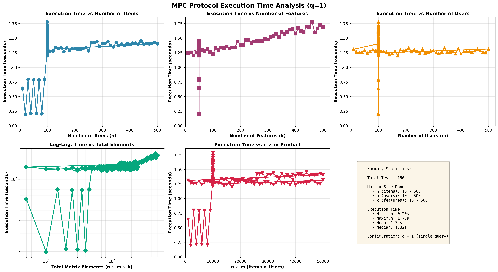
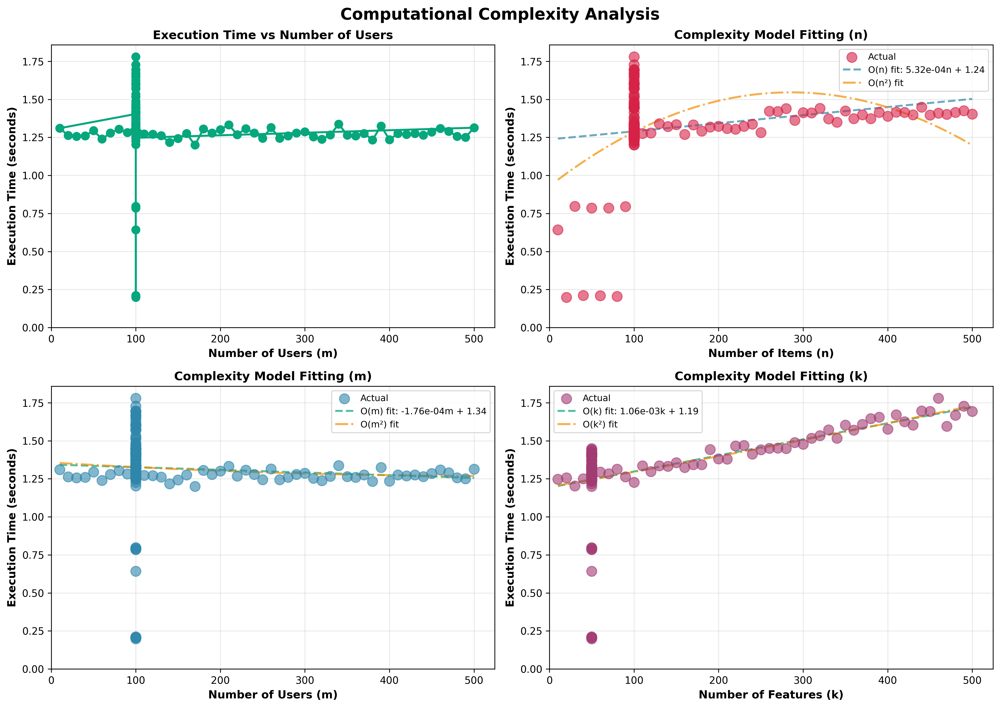

# Assignment 4: Complete Secure Item and User Profile Update using Distributed Point Functions (DPF)

## Approach

Assignment 4 extends previous work on privacy-preserving updates in a recommender system context, focusing specifically on securely updating item profiles when a user issues queries, following the protocol outlined in the assignment description. The solution leverages Distributed Point Functions (DPF) and Multiparty Computation (MPC), ensuring the servers involved never learn which item was updated or the semantic value of the update. In this assignment, I have implemented item updation using additive DPF and integrated it with Assignmnet 1 where user update was implemented.

### Cryptographic Protocol

- **Query Handling:** When a user interacts with an item, the corresponding item profile vector $ v_j $ is updated based on both the user's profile $ u_i $ and the item's profile $ v_j $ itself.
- **Distributed Point Functions:** The user generates DPF keys that encode a "zero message" at the queried index. Servers locally compute shares of the update value using MPC, adjust the correction word in their DPF keys, and then apply the update privately using EvalFull on the new DPF keys.
- **Share Conversion:** Since DPF outputs XOR shares while the item profiles are stored as additive shares, the implementation includes a conversion step where the XOR shares are converted into additive shares as described below: (Reference for this idea is taken from this (https://dl.acm.org/doi/pdf/10.1145/2976749.2978429) paper)

```bash
In generate DPF function, we need to make two final correction words as follows:
FCW0 = some number (random)
FCW1 = (-1)^(f_1) * (value - S0 + S1)

In eval DPF function, we need to send the sum of these final correction words with our own message (i.e., M0 or M1) as FCW, which then should be added to all the leafnodes as follows:
FCW = (-1)^(b) * (Message) + FCW_b
S = (-1)^(b) * (S + f*FCW)

where b is the party id (i.e., 0 or 1)
```

The code provides a general-purpose library of helpers in `DPF.h` and `shares.h`, which handle DPF generation/evaluation, vector arithmetic, share manipulation, and async IO for multiparty execution.

## File Layout

| File            | Purpose                                    |
|-----------------|--------------------------------------------|
| p2.cpp          | Orchestrates secret share generation and manages server-side query distribution and key material handing.|
| pB.cpp          | Implements the main MPC protocol for updating item profiles and all related computations. Needs to be run as either P0 or P1, corresponding to the server role.|
| DPF.h           | Implements DPF-related routines, tree key structures, and cryptographic primitives.|
| shares.h        | Contains MPCShare class, random number helpers, share vector/matrix arithmetic, async IO wrappers.|
| check.cpp    | Provides validation and result checking code to ensure the update was performed correctly and securely.|
| Dockerfile      | Instructions for building each protocol node/server image.|
| docker-compose.yml | Launches all containers, sets server roles, connects shared volumes for inter-process communication.|

## Instructions to Run

### Prerequisites

- Docker (with Compose)
- Boost library headers (if compiling manually)
- C++20-capable compiler (GCC 10+, clang 10+)

### Run Using Docker Compose

* **Generate Queries:** `gen_queries.cpp` generates two files, `input0.txt` and `input1.txt`, containing queries for P0 and P1, respectively.

```bash
g++ gen_queries.cpp -o gen_queries
./gen_queries
```
The script will prompt you to provide n, m, k, Q.
where, n, m, k, Q are the above mentioned parameters

1. Place all `.cpp` and `.h` files into the project directory. Ensure the `Dockerfile` and `docker-compose.yml` are present.
2. Prepare a subdirectory `files/appfiles` containing input files (user/item profiles, queries as needed).
3. From the project root, build and launch all containers:

```
docker compose build
docker compose up
```

This command will build and run three services:
- p2 (trusted dealer/server)
- p0 (party/server 0)
- p1 (party/server 1)

Each will mount the shared volume, execute their respective node logic as specified in the Dockerfile and environment variable `ROLE`.


### Validate correctness:

```sh
g++ -std=c++20 check.cpp -o check
./check
```

## Logs
- Logs and output files are written into `files/appfiles/output.txt` after execution, which can be checked via `check.cpp`.

***

## Plots:
I used the script benchmark_1.sh and generated datapoints in the csv : timing_results_independent.csv file, which then I used to plot these plots.
Checkout the benchmak.log file to get more details of these datapoints.

The following is the execution time plot of n, m, k: (varying other one of them while keeping other fixed)


The following is the plot to understand complexity:
